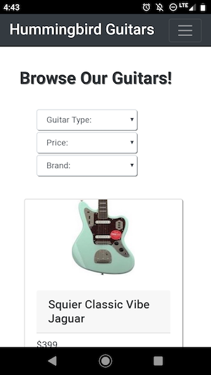

# Hummingbird Guitars mock E-Commerce Site

Hummingbird Guitars E-commerce project is a work to show the workings of ReactJS, NodeJS, MySQL, and Bootstrap together. The site includes several different cool features such as:  

-An automatic image slider using React's Class component state on the home page. 

-A product page loading data from a MongoDB database 

-A contact page that saves the submited form information into a MongoDB database and then loads it to the comment section.

-A Node Express server to handle communication with the database and define the endpoints to send data to the react page.

-A login that uses JWT for authentication

-The app is also a progressive web app. This means that the user can add the web page to their home screen like a native app.

-The app still has some functionality even if there is no internet connection.


All the pages are made to be responsive from computer screens to small mobile screens. This is made possible with both bootstrap and media queries.

## See the Site

[Hummingbird Guitars](https://hummingbird-guitar.herokuapp.com)




## Getting Started

When starting the project execute 

```bash
npm install
```

in the main project folder. This will install the dependencies from both the main package.json as well as the client folder's package.json thanks to a script in the main folders package.json.

To start the server and React-app run

```bash
npm start
```
or

```bash
npm start dev
```

This works thanks to Concurrently which allows React-app and the Node server to run at once in one terminal window.

The client folder has a proxy for localhost:4000 (the port the server is running on) so that you do not run into issues with CORS when using fetch to the server for the data. This also allows for http requests for the server can be used with React-app's localhost:3000.

To be able to use the Mongoose connection with MongoDB you will need to save the MongoDB Atlas Url in a .env file

```bash
ATLAS_URI='your url here'
```

Next to be able to save and compare hashed passwords in the database you will need to add
```bash
SALT_WORK_FACTOR = number of salt
```

Finally you will need to create a JWT_SECRET in the .env file.

## Contributing
This is currently a personal project. If you encounter any issues feel free to open an issue for this repo, and I will try to address it. Feel free to clone this repo and modify it for yourself.

## License

[MIT](https://choosealicense.com/licenses/mit/)

